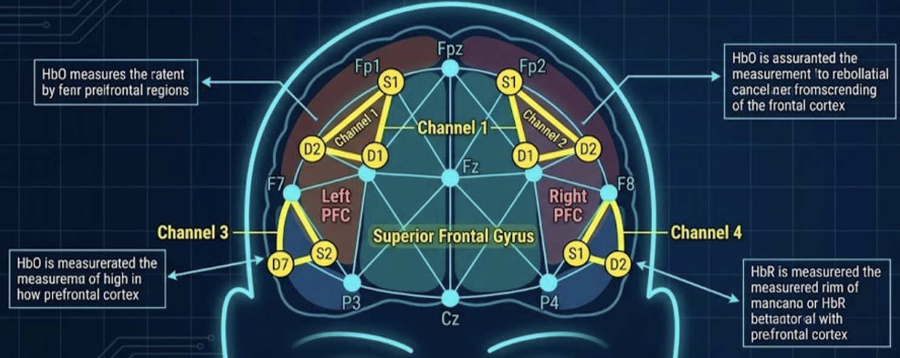
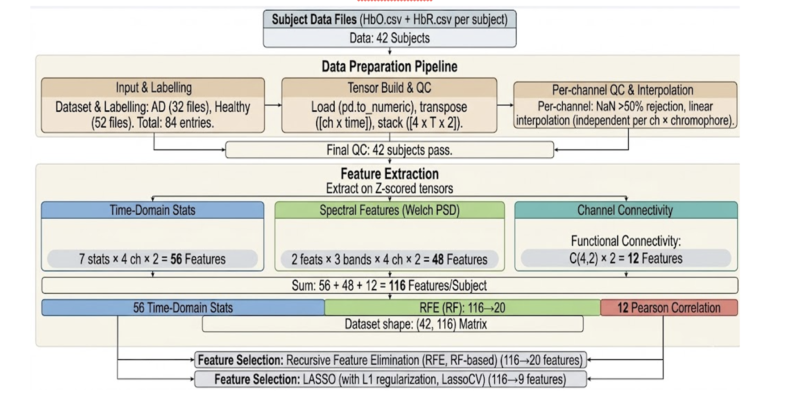

# Multimodal Alzheimer's Disease Classification Using Spectral Features and Biomarkers

<p align="center">
  
  
  
  
  
  
</p>

<p align="center">
  <b>Non-invasive multimodal machine learning for early Alzheimer's disease detection using EEG spectral features and fNIRS hemodynamic biomarkers.</b>
</p>

***

## Overview

A multimodal Alzheimer's disease classification project built using **Python, scikit-learn, NumPy, pandas, and signal-processing techniques** on EEG spectral features and fNIRS hemodynamic biomarkers, with primary implementation focus on the **fNIRS pipeline** for the current repository.

This project is designed as an end-to-end biomedical machine learning workflow for early Alzheimer's detection using non-invasive brain signals. It includes fNIRS preprocessing, HbO/HbR signal cleaning, feature extraction, RFE and LASSO-based feature selection, LOOCV-based model evaluation, Random Forest and baseline classifier comparison, EEG-based multimodal context, and clinically motivated fusion analysis for improved diagnostic performance.

***

## Project Overview

**Multimodal Alzheimer's Disease Classification Using EEG Spectral Features and fNIRS Hemodynamic Biomarkers with Machine Learning** is a biomedical machine learning project that uses non-invasive EEG and fNIRS brain signals to support early Alzheimer's disease detection, with major emphasis on the **fNIRS data pipeline** and **hemodynamic biomarker modeling** for this repository.

The system includes a complete end-to-end workflow for signal-based disease classification:

- EEG spectral feature extraction and subject-level classification.
- fNIRS preprocessing using HbO and HbR signals, including missing-value handling, normalization, and per-subject tensor preparation.
- Time-domain, frequency-domain, and inter-channel connectivity feature engineering for fNIRS biomarker extraction.
- Feature selection using RFE and LASSO to reduce dimensionality and improve model generalization on small clinical datasets.
- Model benchmarking using Random Forest, Logistic Regression, and SVM with LOOCV-based evaluation.
- Clinically motivated threshold tuning and multimodal EEG + fNIRS fusion to prioritize better Alzheimer's detection performance.

The project is built to demonstrate professional machine learning and applied data science skills including biomedical signal preprocessing, feature engineering, statistical learning, model selection, subject-independent validation, clinical-performance optimization, multimodal analysis, experiment design, and research-oriented documentation.

***

## Highlights

- **Primary implementation focus on fNIRS** preprocessing, feature engineering, and classification.
- **116-dimensional fNIRS feature representation** built from statistical, spectral, and connectivity biomarkers.
- **Feature selection comparison** using RFE and LASSO for small-sample clinical data.
- **LOOCV-based evaluation** for robust subject-level generalization analysis.
- **Clinical optimization strategy** through threshold tuning and fusion logic prioritizing recall.
- **Multimodal context** using EEG + fNIRS for stronger diagnostic interpretation.

***

## Visuals / Demo

> After uploading your screenshots to GitHub, keep the image names the same as below or update the paths.

### fNIRS Preprocessing

<p align="center">
  
</p>

### fNIRS Feature Engineering Pipeline

<p align="center">
  
</p>

### Feature Groups and LOOCV Results

will add

### Project Summary Snapshot

will add
***

## fNIRS Dataset Snapshot

- **Subjects:** 42
- **Class distribution:** 16 Alzheimer's Disease (AD), 26 Healthy Controls (HC)
- **Recording state:** Resting state, eyes closed
- **Duration:** 15.1 seconds
- **Sampling frequency:** 10 Hz
- **Signals used:** HbO and HbR
- **Spatial coverage:** 4 channels

***

## fNIRS Feature Groups

| Feature Group | Count | Description |
|---|---:|---|
| Statistical (time-domain) | 56 | Mean, Std, Min, Max, Energy, Skewness, Kurtosis × 4 channels × 2 chromophores |
| Band Power (Absolute) | 24 | Power in 3 frequency bands × 4 channels × 2 chromophores |
| Band Power (Relative) | 24 | Relative power in 3 frequency bands × 4 channels × 2 chromophores |
| Inter-channel Correlation | 12 | Pairwise Pearson correlation across 4 channels × HbO + HbR |
| **Total** | **116** | **Complete per-subject feature vector** |

***

## Pipeline

### fNIRS Workflow

1. Load subject-level HbO and HbR CSV files.
2. Convert raw data into channel-first tensors.
3. Handle missing values using interpolation and subject-level QC rules.
4. Apply per-channel z-score normalization.
5. Extract statistical, spectral, and connectivity features.
6. Compare RFE and LASSO for feature selection.
7. Train and evaluate classifiers using LOOCV.
8. Analyze clinically motivated fusion strategy in multimodal context.

### Modeling Approach

- **Baseline models:** Random Forest, Logistic Regression, SVM (RBF)
- **Feature selection:** RFE and LASSO
- **Validation:** Leave-One-Out Cross-Validation (LOOCV)
- **Clinical focus:** improve AD detection performance while reducing missed positive cases

***

## fNIRS Results

| Feature Set | Model | Accuracy | Precision | Recall | F1-Score |
|---|---|---:|---:|---:|---:|
| RFE (20) | Random Forest | 0.857 | 0.917 | 0.688 | 0.786 |
| RFE (20) | Logistic Regression | 0.786 | 0.769 | 0.625 | 0.690 |
| RFE (20) | SVM (RBF) | 0.667 | 1.000 | 0.125 | 0.222 |
| LASSO (9) | Random Forest | 0.738 | 0.692 | 0.563 | 0.621 |
| LASSO (9) | Logistic Regression | 0.714 | 0.700 | 0.438 | 0.538 |
| LASSO (9) | SVM (RBF) | 0.619 | 0.000 | 0.000 | 0.000 |

### Key Takeaways

- The strongest baseline configuration was **Random Forest with RFE-selected features**.
- RFE performed better than LASSO for this fNIRS feature space.
- The fNIRS pipeline showed strong potential for non-invasive Alzheimer's screening.
- The multimodal setting adds complementary context from EEG-based neural features.

***

## Tech Stack

| Category | Tools |
|---|---|
| Languages | Python |
| Notebook Environment | Jupyter Notebook, Google Colab |
| Data Handling | NumPy, pandas |
| Signal Processing | SciPy (`scipy.signal`, `scipy.stats`, `scipy.interpolate`) |
| Machine Learning | scikit-learn |
| Models | Random Forest, Logistic Regression, SVM (RBF), LDA, XGBoost |
| Feature Selection | RFE, LASSO / L1 regularization, SelectKBest |
| Validation | Leave-One-Out Cross-Validation, Leave-One-Subject-Out, GroupKFold, Stratified K-Fold, RandomizedSearchCV, GridSearchCV |
| Imbalance Handling | SMOTE |
| Visualization | Matplotlib |
| File Format | CSV-based subject data files |
| Documentation | GitHub Flavored Markdown |

***

## Repository Focus

This repository emphasizes the work completed on the **fNIRS side of the project**, especially:

- HbO/HbR signal preprocessing
- tensor preparation and quality control
- statistical and spectral biomarker extraction
- channel connectivity analysis
- RFE and LASSO feature selection comparison
- LOOCV classifier benchmarking
- clinically motivated threshold analysis

While EEG is part of the broader multimodal study, the strongest hands-on implementation contribution presented here is the **fNIRS workflow and modeling pipeline**.

***

## Suggested Repository Structure

```bash
.
├── data/
│   ├── raw/
│   └── processed/
├── notebooks/
│   └── FNIRS-Data-Code-File.ipynb
├── images/
│   ├── image.png
│   ├── image-2.png
├── docs/
│   ├── Research-Paper.docx
│   └── Capstone-Project.pptx
└── README.md
```

***

## Future Improvements

- Add simultaneous EEG-fNIRS subject alignment for stronger fusion experiments.
- Expand dataset size for more robust clinical generalization.
- Add richer visualization dashboards for feature importance and confusion matrices.
- Explore advanced multimodal fusion architectures.
- Extend the framework to Mild Cognitive Impairment (MCI) classification.

***

## Acknowledgments

This project was developed as part of an academic research effort on multimodal Alzheimer's disease classification, combining EEG and fNIRS biomarkers to study early-stage diagnostic prediction.g
